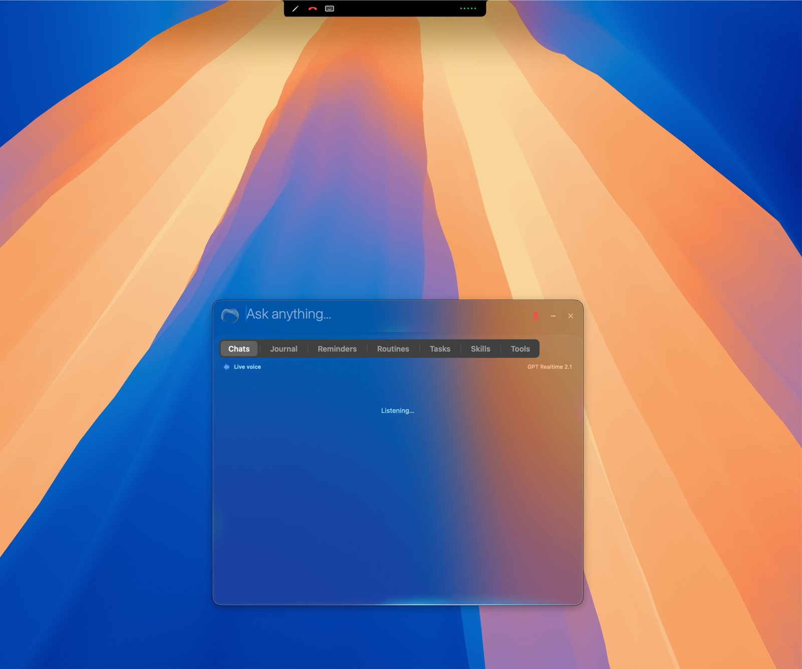
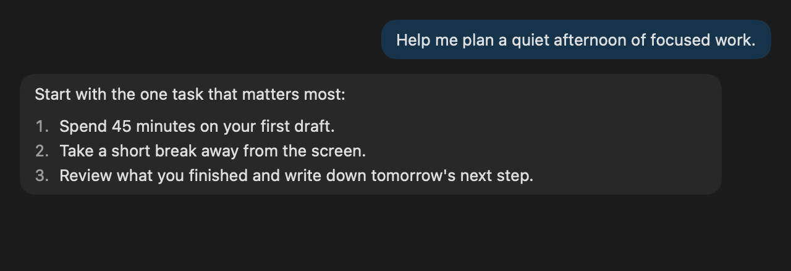
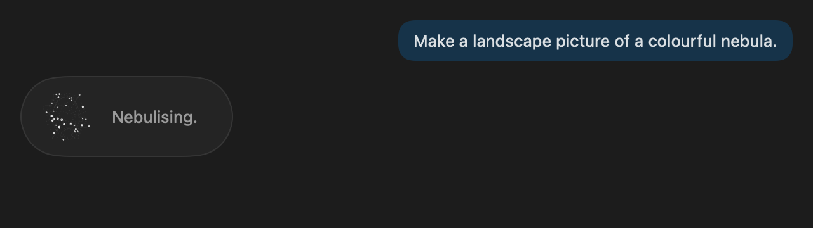
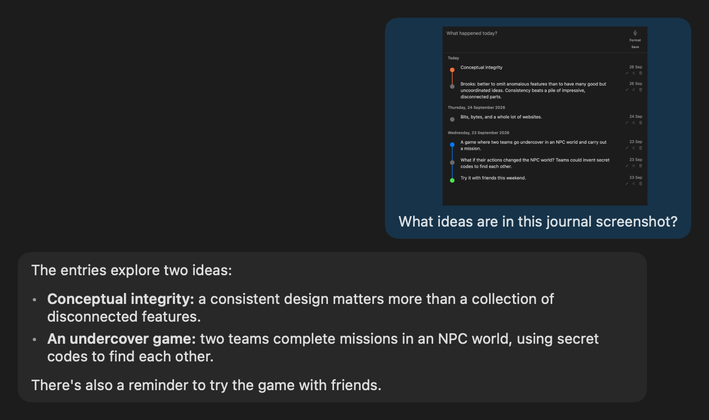
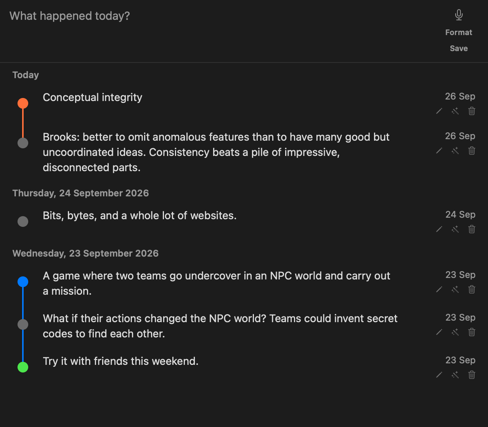
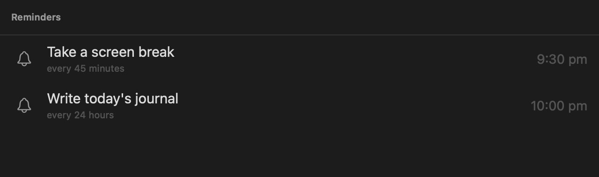
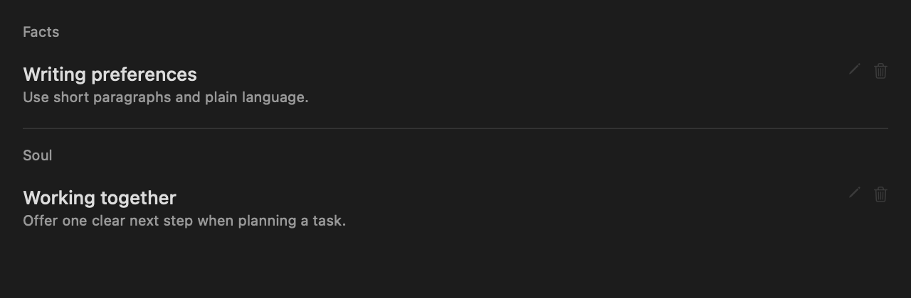

# Astro

A native macOS assistant that lives in your menu bar and beside the notch. Chat, talk hands-free, create and discuss images, keep a journal, and set reminders without leaving what you're doing.



**Press Option + Space (⌥Space) and start talking.** Once voice is set up and microphone access is granted, the shortcut opens Astro and starts listening automatically. No extra microphone click is needed.

## Install Astro

**The first signed DMG and Homebrew release is not available yet.** Packaging is being prepared; publication is waiting for Apple Developer ID signing and notarization. [View GitHub Releases](https://github.com/Optimisedigi/astro/releases) for release availability.

The planned download supports **Apple silicon Macs (M1 or later), macOS 15 or later**. End users will not need Xcode or a compiler.

### Mac installer (DMG)

Once the signed release is published, download **Astro.dmg**, open it, and drag **Astro.app** into **Applications**. Launch Astro and connect your AI account. The README will link directly to the verified DMG when it is available; there is no unsigned download to work around macOS security checks.

### Homebrew

The Homebrew installer will download that same signed DMG, rather than compiling Astro. **These commands become available after the first release and cask are published:**

```sh
brew tap optimisedigi/astro https://github.com/Optimisedigi/astro
brew install --cask optimisedigi/astro/astro
```

For now, the available installation path is the [developer source build](#build-from-source-developers). Maintainers can follow the [signed-release guide](docs/RELEASING.md).

## A look inside

The feature previews below show Astro's SwiftUI content views with **sample conversations and entries**, not private user data or recordings of live calls. Unlike the main screenshot above, these are rendered documentation previews; window chrome and some controls are omitted.

### Chat



### Image creation



### Chat about images



### Journal



### Reminders



### Memory



## Features

### Chat and model selection

- Stream replies with Markdown, code blocks, tables and checklists. Browse saved conversations and start fresh chats.
- Open **AI Settings → Active Model** to select a different model. Connect the matching provider in the same settings sheet.
- The model picker includes **OpenAI GPT, Anthropic Claude, Google Gemini, Kimi, Moonshot, MiniMax and Xiaomi MiMo** options. Model availability depends on the connected account, plan and provider.
- OpenAI, Anthropic, Gemini and Kimi offer account sign-in; Moonshot, MiniMax and MiMo use API keys. Credentials are stored in macOS Keychain.
- Tools let Astro read and edit files, run shell commands, search the web and fetch pages. Shell commands run with your user account's permissions, so review what you ask it to execute.

### Image creation and image conversations

Ask Astro to make a picture in chat or during a live voice call. **Image generation uses your ChatGPT sign-in**, even if another provider is selected for chat.

- Request square, landscape or portrait artwork. While it is being created, the orb and animated **Nebulising...** indicator show progress.
- Finished images appear in the chat reply, or in a preview window during a call. A copy is saved in `~/Pictures/Astro`.
- Drop an image onto the notch attachment area or paste one into chat, then ask about it. OpenAI live voice can also receive images during a call.
- Vision-capable models can discuss the image itself. For text-only models, Astro includes recognised text from the image; that is not a substitute for visual understanding.

### Journal: capture, tidy and revisit your day

The **Journal** tab keeps entries in dated, connected threads. It is separate from chat history and assistant memory.

1. **Write or dictate.** Type into “What happened today?” or use the microphone. The notch pencil shortcut can start journal dictation directly.
2. **Tidy the entry.** Press **Format** to ask the selected AI model to clean up the writing. Stopping dictation also triggers formatting; it is intended to tidy your words, not answer them as a chat.
3. **Save.** Press **Save** to add the entry to today's thread. Your unsaved draft survives switching tabs.
4. **Revisit.** Edit, format or delete saved entries. Mark them **Highlight**, **Do later** or **New idea** to make them easier to find visually.

Journal entries are stored locally and are **not automatically included in chat prompts or memory**. Formatting sends the entry being formatted to the selected AI provider. A **Do later** marker is an organisation aid, not a scheduled reminder; ask Astro separately to notify you at a time.

### Reminders and routines

Use plain language, such as “Remind me to stretch in 45 minutes” or “Remind me to write my journal every day at 6pm.”

- **Reminders** deliver a notch alert or macOS notification. View and remove scheduled items in the Reminders tab.
- **Routines** run an assistant prompt on a schedule, such as preparing a daily summary.
- Schedules support one-off times, repeating intervals and cron expressions. Next-run times use the Mac's local time zone.
- Keep Astro running for schedules to fire. Due jobs are checked about every 30 seconds and again when Astro starts; it does not wake a sleeping Mac. Allow notifications in macOS settings for system alerts.

**Layout and dimensions:** the main panel starts at **680 × 560 points**, shared by chat, reminders and journal. The journal switches to its compact layout below **520 points** wide; its composer is **82 points** high when idle and **136 points** while writing or dictating. The screenshots above are content crops rendered at 2× resolution, not fixed screen-size requirements.

### Memory across conversations

Tell Astro what you want it to remember, such as your writing preferences or the project you're working on.

- **Facts** hold information about you, your preferences and projects.
- **Soul** holds guidance about how Astro should work with you, including tone and communication preferences.
- Open **Memory** in settings to inspect, edit or delete individual entries, or use **Forget All** to clear them.
- Memory is stored locally. A size-limited selection is included in assistant prompts, so it is sent to the AI provider used for that conversation. Journal entries remain separate.

### Voice, OpenAI Live and GPT-Live

**OpenAI Live has been tested in live use.** Start and end a call from the notch or the panel microphone. Speech streams both ways, you can interrupt a reply, and the conversation's transcript is visible in the panel. Minimise the panel to keep talking; the transcript is saved as a **Voice Call** chat when the call ends.

Choose the engine, voice and live model in **Voice Settings**:

- **OpenAI Live:** uses the ChatGPT account connected in AI Settings. The live model choices include **GPT Realtime 2.1**, **GPT Realtime 2.1 mini** and **GPT-Live 1**.
- **GPT-Live 1:** ChatGPT's live voice option, with its own voice selection. It can discuss shared images and call tools, including image generation and reminders.
- **Built-in voice:** Apple speech recognition → the selected chat model → Kokoro speech output, with macOS speech as a fallback.
- **Journal dictation:** captures and formats an entry instead of starting a conversation.

Microphone and speech-recognition permissions are needed for the corresponding voice features. Connected providers' plan limits still apply.

### More desktop tools

- **Tasks:** named checklists, completion tracking and quick access from a tab.
- **Skills:** local instruction files for specialised tasks, including installation from GitHub.
- **Clipboard history:** revisit copied text, images and file references.
- **Optional local knowledge:** search indexed material through `qmd` when it is installed and configured.
- **Permissions dashboard:** check microphone, speech recognition, Accessibility, screen recording, Full Disk Access and notifications as needed for the tools you use.

## Build from source (developers)

Requires an **Apple silicon Mac**, **macOS 15+**, a current **Xcode** installation and `xcodegen`. This developer route compiles Astro locally. The `brew install xcodegen` command installs a build tool, not Astro itself.

```sh
brew install xcodegen
git clone https://github.com/Optimisedigi/astro.git
cd astro
./install.sh
```

The installer builds the app, runs its self-test and copies it into Applications. Launch **Astro**, connect a provider in **AI Settings**, and grant only the macOS permissions needed for the features you use.

## Development

The app is named **Astro**. The Swift package, target and executable retain the internal name `Universe` for compatibility.

```sh
swift build
swift run Universe --selftest
```
